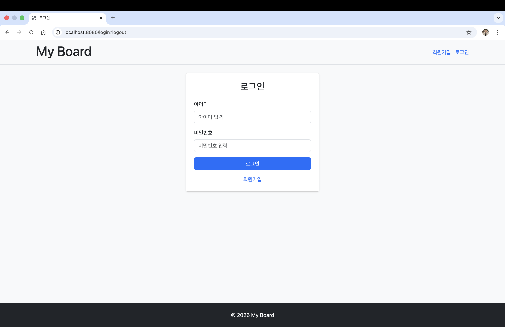
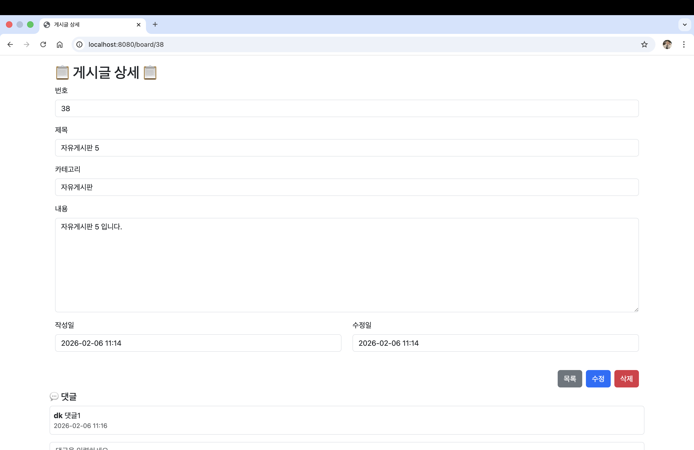

# Spring Board Project

## 📌 프로젝트 소개
Spring Boot 기반 웹 게시판 프로젝트입니다.
회원 인증, 게시글/댓글 CRUD, 작성자 권한 체크, 페이징 처리 등 실무에서 자주 사용되는 기능을 구현했습니다.
Controller → Service → Repository 계층 구조를 따르고, JPA를 활용한 효율적인 데이터 처리 경험을 쌓았습니다.

---

## 🛠 기술 스택
- **Language:** Java 21
- **Framework:** Spring Boot
- **ORM:** Spring Data JPA
- **View:** Thymeleaf, Bootstrap 5
- **DB:** MySQL 
- **Build Tool:** Gradle
- **Auth:** Session 기반 로그인
- **Version Control:** Git, GitHub

---

## 📂 프로젝트 구조
```
src
└── main
├── java
│   └── com.cloudg.board
│       ├── controller
│       ├── service
│       ├── repository
│       └── entity
└── resources
├── templates
└── static
```
---

## ✨ 주요 기능
- 회원가입 / 로그인 / 로그아웃
- 게시글 CRUD (작성자만 수정·삭제 가능)
- 게시글 목록 페이징 및 검색
- 댓글 작성 및 삭제
- 카테고리별 게시글 조회
- Validation 적용 및 오류 메시지 처리
- 게시글 삭제 시 연관된 댓글까지 soft delete 처리

---

## 🔍 핵심 구현 포인트
- Spring Data JPA로 CRUD 로직 간결화
- 계층 구조 분리: Controller → Service → Repository 
- Session 기반 로그인 상태 관리 
- 게시글 작성자 권한 체크 로직 적용
- 페이징 처리로 대용량 데이터 조회 최적화
- 카테고리 연관관계 설정 및 선택 유지 처리
- Validation 적용으로 입력 데이터 검증
- 게시글 및 댓글 Soft Delete 설계 (deleteDate 기반 삭제 전략)
  - 데이터 물리 삭제 없이 deleteDate 갱신 방식으로 관리
  - 게시글 삭제 시 연관된 댓글까지 트랜잭션 내에서 함께 처리
  - 조회 시 deleteDate IS NULL 조건으로 사용자 노출 제어

---

## 🧠 고민했던 부분
- JPA 연관관계 설정 (ManyToOne, Fetch 전략, 단방향 vs 양방향)
- 권한 체크 위치 및 책임 분리 (Controller vs Service)
- Validation 처리 및 BindingResult 활용
- 페이징과 정렬 로직 구현 및 Thymeleaf와의 연동
- 선택한 카테고리 유지 및 조회 필터링
- Hard delete 대신 Soft delete를 선택한 이유와 적용 범위 설계
  - 게시글과 댓글 간 데이터 정합성 유지
  - 삭제 이력 관리 및 확장 가능성 고려

---

## 🚀 실행 방법
1. 저장소 클론

git clone https://github.com/Cloudgkim/spring-board-project.git


2. application.properties 설정

spring.datasource.url=jdbc:mysql://localhost:3306/board_db?serverTimezone=Asia/Seoul&useSSL=false&allowPublicKeyRetrieval=true
spring.datasource.username=root
spring.datasource.password=test1234


3. 실행

./gradlew bootRun

---

## 📸 화면 예시

- 로그인 화면  
  

- 게시글 목록  
  

- 게시글 상세  
  

---

## 🔧 개선 및 학습한 점
- Spring Security 적용으로 인증 구조 강화 가능
- ControllerAdvice를 활용한 예외 처리 공통화 경험
- JPA fetch 전략 최적화 및 페이징 성능 개선 경험
- Validation 적용 및 오류 메시지 처리 경험
- Git 커밋 메시지 정리 및 브랜치 관리 경험
- Soft delete 설계를 통해 데이터 이력 관리 및 운영 관점의 삭제 전략 이해

